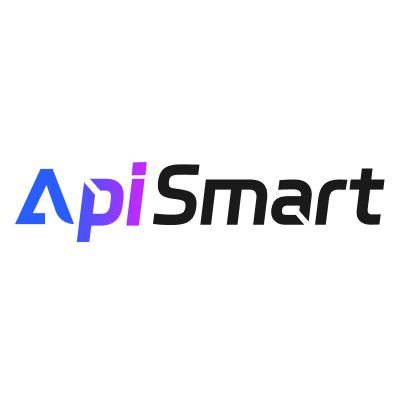

# YT Short Clipper v3

A Windows desktop app that turns a long-form YouTube video into ready-to-post 9:16
short-form clips — picking the highlights with an LLM, reframing to portrait, and burning
in word-by-word captions.

**Stack:** React 19 + TypeScript + Vite · Tauri v2 (Rust shell) · Python sidecar (yt-dlp,
FFmpeg, MediaPipe)

> **Windows only.** The build scripts are PowerShell, the app ships as a portable zip with
> a WebView2 bootstrapper, and caption/hook rendering reads fonts from `C:\Windows\Fonts`.
> Nothing is macOS/Linux-ready today.

> **Status: beta.** Expect rough edges and breaking changes between releases.

## Changelog

### v2.0.34-beta (2026-09-16)

- **Split screen 70/30** — the default split ratio is now **70% main video (top) /
  30% webcam (bottom)** (was 55/45), so the host stays dominant in podcast /
  reaction clips.
- **Volume balance** — two sliders in the split-screen panel let you set the
  volume of the top (main) and bottom (webcam) tracks independently (0–100%)
  *before* they are mixed, so a quiet guest or loud background can be balanced
  in one pass.
- **Per-clip progress bar** — the Processing Clips page now shows a live
  `2/5 selesai · 40%` counter instead of sitting at 0% until the very end. The
  progress bar fills as each clip finishes rendering.
- **Cleaner processing log** — per-second `Download progress: X%` lines are no
  longer written to the log. Download status is reported by a 15-second
  heartbeat (`⏳ Still downloading: 45% …`) plus the important events
  (download complete, merge, throttling warnings), so the console is readable
  while the stall-detection watchdog keeps working underneath.

### v2.0.31-beta (2026-09-15)

- **Download quality selector** — pick the source video quality before clipping:
  **1080p / 720p / 480p / 360p** (default **720p**). Lower quality downloads
  significantly less data (720p ≈ −50%, 480p ≈ −75%, 360p ≈ −85%), cutting
  download time dramatically on slow connections. Best for Shorts, since the
  final output is 1080×1920 regardless — the source is just sampled at a lower
  resolution before the crop.
- **Processing link in the sidebar** — a **Processing** item (clapperboard icon)
  now sits between Library and AI Models, so you can jump back to in-flight
  clips without navigating through Settings.

### v2.0.30-beta (2026-09-15)

- **Persistent processing state** — the Processing Clips page now stores its
  session (URL, highlights, options, logs, progress) in a Zustand store instead of
  ephemeral React state. Navigating to Settings (or any other page) and coming back
  restores the full view; the sidecar keeps running in the background the whole time.
- **Log toggle on the processing page** — a **Log: On / Off** button (eye icon)
  sits directly in the Processing Clips header so you can hide or reveal the log
  console without leaving the screen.

### v2.0.29-beta (2026-09-15)

- **Appearance settings** — new **Appearance** section in Settings: switch between
  **Dark (pekat)** and **Light** mode. The dark theme uses a deep palette
  (`#0c0c1c` / `#111125`) across every screen, sidebar, card, and dialog. On first
  launch the app follows your OS preference; your choice is remembered afterwards.
  A quick sun/moon toggle also lives at the bottom of the sidebar.
- **Log output switch** — toggle the debug log console on/off from
  Settings → Appearance. Off hides the log panel on the *Finding Highlights* and
  *Processing Clips* screens (progress bar and step list stay visible).
- **Removed sidebar links** — *Topup AI Credit* and *Video Tutorial* are gone from
  the sidebar. They are now blocked client-side too, so the menu API cannot bring
  them back.

### v2.0.28-beta (2026-09-15)

- **CPU fix on slow machines** — the download progress spam (8 concurrent
  connections × multiple progress lines per second) was saturating low-end CPUs.
  Raw yt-dlp progress lines are now dropped and rendered by the app's own
  rate-limited progress hook (1 update/second), with `noprogress` enabled — visible
  CPU load drops sharply on 2-core machines.

### v2.0.27-beta (2026-09-15)

- **Download speed fix** — the old flow downloaded each section through FFmpegFD
  (single connection), which gets throttled by YouTube (as low as 17 KiB/s on some
  ISPs). Downloads now use the native `HttpFD` downloader with **8 parallel
  connections** (100–192 KiB/s in testing, 6–11× faster). Sections are cut locally
  after one full download, so no section is ever re-downloaded.
- **More robust releases** — portable/update assets are uploaded separately from
  release creation, so a transient GitHub 500 on one file no longer fails the whole
  release; uploads are retried with `--clobber`.
- **BotGuard hardening** — YouTube JS challenges handled via player clients that
  avoid the hang (`player_client=visionos,ios,android,tv_downgraded`,
  `player_skip=js`).

## What it does

1. You paste a YouTube URL and upload your own `cookies.txt` (see
   [YouTube cookies](#youtube-cookies)).
2. yt-dlp fetches the video and its original subtitle track.
3. An LLM reads the transcript and proposes highlight segments (58–120s by default).
4. Each segment is cut, reframed to 9:16, captioned, and written out as an MP4.
5. Optionally, clips are uploaded and scheduled through [Repliz](https://api.repliz.com).

## Features

- **AI highlight detection** from the video's subtitle transcript, via any
  OpenAI-compatible endpoint
- **AI direction** per video — free-text steering: name a time range, chase a recurring
  topic, or rule material out
- **Output language** for titles and hook text, defaulting to the video's own language
- **Portrait reframe** in three modes: face tracking (MediaPipe), centered on black bars,
  or centered on a blurred fill — the centered modes are dramatically faster since they
  skip per-frame face detection
- **Word-by-word captions** burned from YouTube's original subtitle track — no
  transcription API and no local Whisper model required
- Optional **hook text overlays** and logo/credit watermarks
- **Direct upload** to the Repliz social media platform

### AI providers

A single provider is configured once in **AI Models** and shared by highlight detection
and title generation. Anything OpenAI-compatible works; the app ships presets for OpenAI,
Google Gemini, Groq, ApiSmart, the maintainer's own YTClip AI gateway, and a
Custom/Local option for vLLM, Ollama, or similar. Your API key is stored in the app's
local data directory — it is never committed and never sent anywhere except the provider
you configured.

### AI direction

Left empty, the model picks clips on its own. Filled in, the direction outranks the
built-in selection principles:

- An explicit clock range (`2:00 - 2:50`) is used **exactly** — that clip is exempt from
  the usual 58–120s duration filter, and the run samples at a lower temperature so the
  instruction is actually followed.
- Array order is clip order, so "clip pertama dari …" lands first in the list.
- Anything the direction rules out is left out.

Custom system messages (in **AI Models**) can place the direction with a
`{user_direction}` placeholder; without it the direction is appended at the end.

## YouTube cookies

The app needs cookies from a logged-in YouTube session for yt-dlp to fetch subtitles and
video. You supply your own — nothing is bundled.

1. Open YouTube in your browser and make sure you are logged in.
2. Install the **Get cookies.txt LOCALLY** extension.
3. Run it while on `youtube.com` and export `cookies.txt`.
4. In the app, click **Upload YouTube cookies to continue** and pick that file.

Notes:

- Don't log out of YouTube after exporting — that invalidates the cookies.
- Frequent 403s mean the cookies went stale; export a fresh file.
- A valid export contains `SID`, `HSID`, `SSID`, `APISID`, `SAPISID`, and `LOGIN_INFO`.
- `cookies.txt` grants access to your Google account. It is gitignored here, stored only
  in the app's local data directory, and passed to yt-dlp on your machine — but treat the
  file itself like a password and never share it.

## Prerequisites

- [Node.js](https://nodejs.org/) v18+
- [Rust](https://www.rust-lang.org/) latest stable
- [Python](https://www.python.org/) 3.13+
- Windows 10/11 with PowerShell

## Setup

```bash
# 1. Install Node dependencies
npm install

# 2. Install Python dependencies
py -m pip install -r requirements.txt

# 3. Download runtime binaries (FFmpeg, Deno)
#    Existing files are skipped — add -Force to actually re-download them.
powershell -ExecutionPolicy Bypass -File scripts/fetch-deps.ps1

# 4. Build the Python sidecar executable
npm run build:sidecar
```

FFmpeg must be a **GnuTLS** build (the fetch script pulls one from gyan.dev). Schannel
builds hang forever on the byte-range requests used for section downloads.

## Development

```bash
npm run dev          # Start Vite dev server
npm run tauri dev    # Start Tauri dev window
```

> **Python changes need a sidecar rebuild.** `src-tauri/binaries/ytclip-sidecar-*.exe`
> takes precedence over the dev Python module, so edits under `yt_short_clipper_core/`
> do nothing until you run `npm run build:sidecar` — the app keeps running the frozen
> copy without complaining. Delete that binary to fall back to
> `py -m yt_short_clipper_core.sidecar` for fast iteration. Frontend and Rust changes
> hot-reload as usual.

### Updating yt-dlp

```bash
py -m pip install --upgrade yt-dlp   # 1. upgrade the package
                                     # 2. bump the floor in requirements.txt
npm run build:sidecar                # 3. re-freeze it into the sidecar
```

Check the yt-dlp changelog for a raised **Deno** floor while you are there (2026.06.09
raised it to v2.3.0). Deno drives `remote_components` for YouTube's JS challenges, so an
under-floor binary breaks extraction quietly — and `fetch-deps.ps1` will not replace an
existing `deno.exe` without `-Force`.

## Release Build

```bash
# One command: sidecar → frontend → Tauri build → assemble portable zips
npm run release
```

This produces two zips in `src-tauri/target/release/bundle/`:

- `YTShortClipperV2_<version>_x64_portable.zip` — full bundle for new users
- `YTShortClipperV2_<version>_x64_update.zip` — app + sidecar only, for existing users

See [BUILD_GUIDE.md](BUILD_GUIDE.md) for the full release flow, version bumping
(4 files), and the build-only-what-changed shortcuts.

## Network calls & telemetry

Being transparent about every host the app talks to, since some of it is the maintainer's
own backend rather than a third party:

| Endpoint | When | What is sent |
|---|---|---|
| YouTube / `googlevideo` (via yt-dlp) | Fetching video + subtitles | Your YouTube cookies |
| Your configured AI provider | Highlight + title generation | Subtitle transcript, your prompt, your API key |
| `api.ytclip.org/webhook/yt-clipper/latest-version` | On launch | Random installation ID, app version |
| `api.ytclip.org/webhook/yt-clipper/notification` | On launch | Random installation ID, app version |
| `api.ytclip.org/webhook/yt-clipper/menu` | On launch | Random installation ID, app version |
| `api.ytclip.org/webhook/yt-clipper/success-log` | After a clip renders | Random installation ID, app version, clip duration, reframe mode |
| `api.ytclip.org/webhook/yt-clipper/presigned-url` + `api.repliz.com` | Only if you use Repliz upload | Filename, the video file, your Repliz keys |

No video content, transcript, or account identity is sent to `api.ytclip.org`. The
installation ID is a random value generated locally, not tied to any account. If you fork
this, point these at your own backend or strip them out — see
[`src/hooks/`](src/hooks/).

### Sidebar links

The external links at the bottom of the sidebar are served by
`api.ytclip.org/webhook/yt-clipper/menu`, so they can change without an app release.
The four page routes above them stay hardcoded. The client also blocks specific
menu ids (`topup`, `tutorial`) permanently, regardless of what the API returns.

Icons are named by the API as kebab-case strings and resolved through the allowlist in
[`src/config/menuIcons.ts`](src/config/menuIcons.ts) — an icon must exist there before
the server can use it. Responses are validated (https-only URLs, capped count and label
length, bad entries dropped individually), cached, and fall back to
`DEFAULT_MENU_ITEMS` in [`src/hooks/menu.ts`](src/hooks/menu.ts) when offline.

## Sponsors

### AI Provider Sponsor

<a href="https://www.apismart.ai">
  
</a>

### Become a sponsor

Interested in sponsoring this project? Reach out at
[sponsorship@ytclip.org](mailto:sponsorship@ytclip.org).

## Legal

This tool automates downloading and re-cutting YouTube videos. Only use it on content you
own or are otherwise licensed to reuse; downloading or republishing third-party videos may
violate YouTube's Terms of Service and copyright law in your jurisdiction. You are
responsible for what you process and post. The maintainer provides no warranty and accepts
no liability — see [LICENSE](LICENSE).

Not affiliated with, endorsed by, or sponsored by YouTube, Google, OpenAI, or Repliz.

## License

[MIT](LICENSE) © Aji Prakoso
